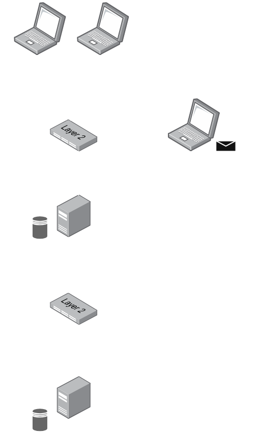

# T27 DeathNode

## Team

| Number | Name              | User                             | E-mail                              |
| -------|-------------------|----------------------------------| ------------------------------------|
| 117363 | David Pinheiro    | <https://github.com/alarmant0>   | <mailto:david.m.pinheiro@tecnico.ulisboa.pt>   |
| 116509 | João Marques      | <https://github.com/joaorvm>     | <mailto:joaorvmarques@tecnico.ulisboa.pt>     |
| 107242 | Mehak Khosa       | <https://github.com/mehakkhosa>  | <mailto:mehakpreet.khosa@tecnico.ulisboa.pt> |

  

## Contents

This repository contains documentation and source code for the *Network and Computer Security (SIRS)* project.

The [REPORT](REPORT.md) document provides a detailed overview of the key technical decisions and various components of the implemented project. It offers insights into the rationale behind these choices, the project's architecture, and the impact of these decisions on the overall functionality and performance of the system.

This document presents installation and demonstration instructions.

## Installation

To see the project in action, it is necessary to setup a virtual environment, with 2 networks and 5 machines.

The following diagram shows the networks and machines:



### Prerequisites

All the virtual machines are based on: Linux 64-bit.

**Important:** Only the Gateway VM has internet access. All other VMs (Auth, Alice, Bob, Kira) are offline and must receive files through a shared folder.

[Download](https://www.kali.org/get-kali/#kali-installer-images) and [install](https://github.com/tecnico-sec/Setup) virtual machine. Clone the base machine to create the other machines.

### File Distribution (Offline VMs)

Since most VMs have no internet access, use a shared folder to distribute:

1. **Project repository** - Copy `T27-DeathNode` folder to all VMs
2. **Maven cache** - Generate `m2.tgz` on Gateway and copy to offline VMs
3. **CA certificates** - Already included in repo under `certs/ca/`
4. **Maven installation** - Download Maven .tar.gz on Gateway and copy to offline VMs

**Shared folder setup:**
- Configure VirtualBox shared folder on all VMs
- Mount point: `/media/shared` (or your preferred location)
- Copy files from shared folder to VM local directories


(Like this, on all VM's, so they have the maven and the project shared)

```sh
# Example on offline VMs
cp -r /media/shared/T27-DeathNode ~/
cp /media/shared/m2.tgz ~/
cp /media/shared/apache-maven-3.9.5-bin.tar.gz ~/
```

### Maven Installation (Offline VMs)

On offline VMs, install Maven from the shared folder:

```sh
# Extract Maven
cd ~
tar -xzf apache-maven-3.9.5-bin.tar.gz
sudo mv apache-maven-3.9.5 /opt/maven

# Add Maven to PATH
echo 'export PATH=/opt/maven/bin:$PATH' >> ~/.bashrc
source ~/.bashrc

# Verify installation
mvn -version
```

### Machine configurations

Inside each machine, copy the project from the shared folder:

```sh
# Copy project from shared folder to local VM
cp -r /media/shared/T27-DeathNode ~/
cd ~/T27-DeathNode
```

#### Auth Machine

This machine runs the Authentication and Invitation Token Service on port 443.

To run:

```sh
sudo ./setup_scripts/run-auth.sh
```

If you receive the following message `TLS=false` then ensure the CA certificates exist in `certs/ca/` and the keystore is generated.

#### Gateway Machine (Server API)

This machine runs the main Application Server on port 443 and connects to Auth at `https://10.0.1.20:443`.

To run:

```sh
sudo ./setup_scripts/run-gateway.sh
```

#### Client Machines (Alice, Bob, Kira)

These machines run the terminal UI client and connect to Gateway at `https://10.0.2.10:443`.

To run:

```sh
sudo ./setup_scripts/run-alice.sh
sudo ./setup_scripts/run-bob.sh
sudo ./setup_scripts/run-kira.sh
```

To test:

```sh
sudo ./setup_scripts/run-alice.sh
```

The expected results are the terminal UI launching with TLS connection to Gateway.

If you receive the following message `Keystore password must be at least 6 characters` then set a longer `NODE_PASS` (inside the run-*.sh script).

## Online Installation (Optional)

If you prefer to give VMs temporary internet access for package installation, you can:

### Option 1: Temporary Internet for Setup

1. **Enable internet on VM** during initial setup
2. **Install packages normally:**
   ```sh
   apt-get update
   apt-get install -y openjdk-17-jdk maven git iptables-persistent
   ```
3. **Clone project directly:**
   ```sh
   git clone https://github.com/tecnico-sec/T27-DeathNode.git
   cd T27-DeathNode
   ```
4. **Build once to populate Maven cache:**
   ```sh
   mvn -U -DskipTests compile
   ```
5. **Disable internet** and run setup scripts

## Demonstration

Now that all the networks and machines are up and running, the system demonstrates invitation-token-based authorization with TLS.

**Note:** Only Bob and Alice can create tokens (privileged users). Kira must join using a token provided by Bob or Alice.


After running the commands, you can create a invitation token on the `View Reports` Menu.
It's important to notice, you can only create new users, with a token created by Alice or Bob.


### Security mechanisms demonstrated:

1. **TLS encryption**: All communication uses HTTPS with mutual certificate trust
2. **Privileged token creation**: Only Bob and Alice can create invitation tokens
3. **Invitation token enforcement**: New clients (like Kira) must present a valid, time-limited token
4. **Firewall isolation**: iptables rules prevent direct client-to-auth communication
5. **Token consumption**: Each token is single-use and becomes invalid after enrollment
6. **Persistent enrollment**: Once enrolled, clients can join without tokens

### Verification commands:

```sh
# Check Auth server logs
tail -f logs/auth.log

# Check Gateway logs  
tail -f logs/gateway.log

# Verify firewall rules
sudo iptables -L -n -v
```

## Additional Information

### Links to Used Tools and Libraries

- [Java 17](https://openjdk.java.net/)
- [Maven 3.9.5](https://maven.apache.org/)
- [Lanterna](https://github.com/mabe02/lanterna)
- [Gson](https://github.com/google/gson)
- [SQLite-JDBC](https://github.com/xerial/sqlite-jdbc)

### License

This project is licensed under the MIT License - see the [LICENSE.txt](LICENSE.txt) for details.